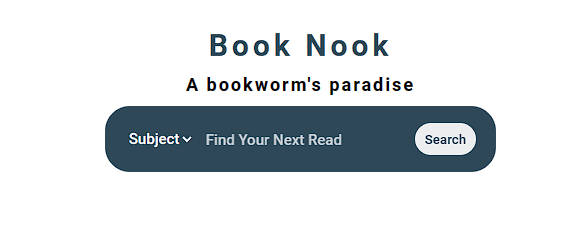
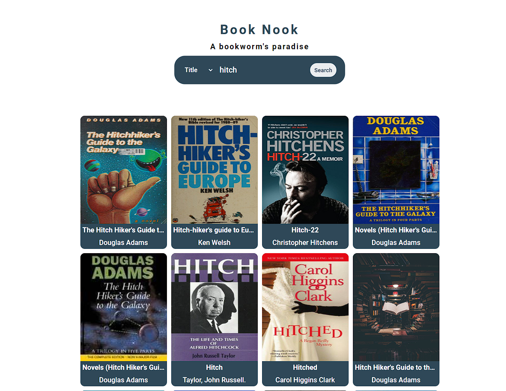
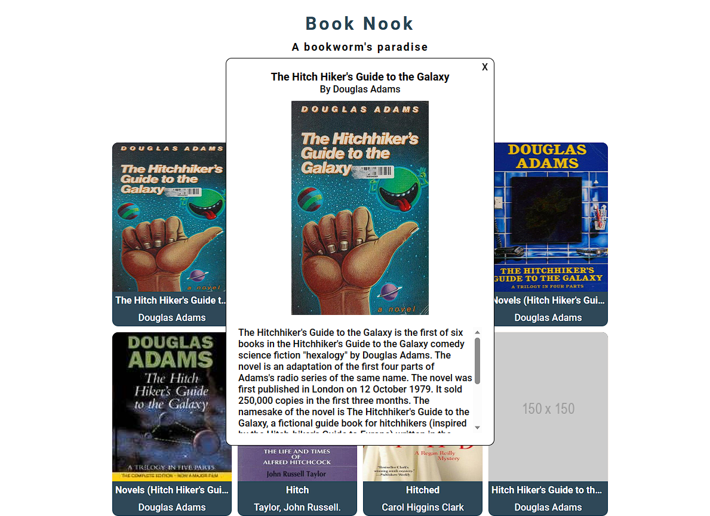

# Book Nook
Book nook is a web application that allows users to search for books using the Open Library API. The application displays a list of books based on the user's search query and allows the user to view an overview of each books by clicking on it.

## Try it
[Click here](https://booknookapp.netlify.app/) or clone the repository.

## API 
This application uses the [Open Library API]('https://openlibrary.org/developers/api') to search for books.

## Preview

## Technologies Used

